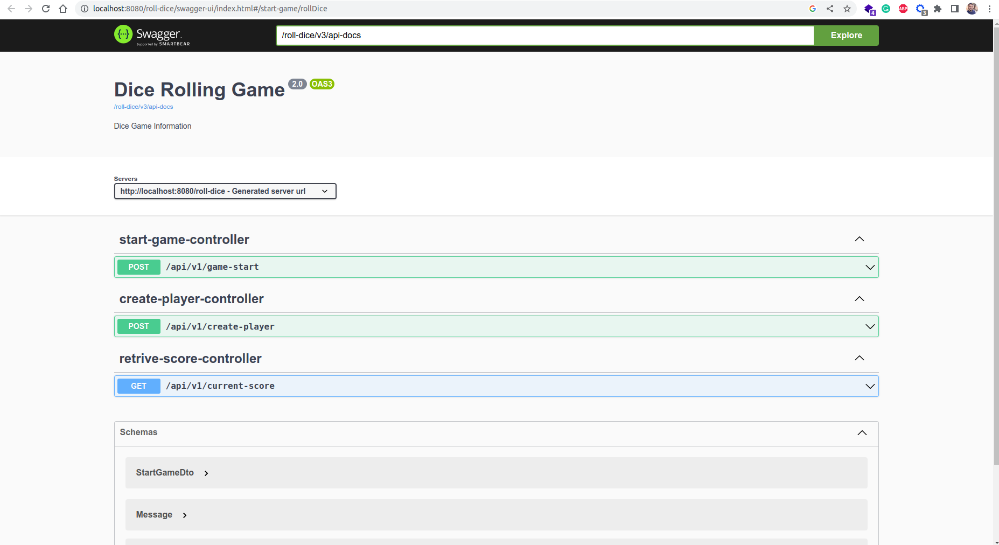

## For running game service

```bash
# Running from docker
sudo chmod u+x run.sh
./run.sh
```
# For running and building service standalone
```bash
# For running
mvn spring-boot:run

# For build
mvn install 

```
# Accessing api
```bash
# Create player
curl --header "Content-Type: application/json" \
  --request POST \
  --data '{"id": 1,"name":"Sharif", "age": 30}' \
  localhost:8080/roll-dice/api/v1/create-player
```
```bash
# Start Game
curl --header "Content-Type: application/json" \
--request POST \
--data '{"name":"Sharif"}' \
http://localhost:8080/roll-dice/api/v1/game-start
```
```bash
# Get result
curl --header "Content-Type: application/json" \
--request GET \
http://localhost:8080/roll-dice/api/v1/current-score
```
## Swagger url
http://localhost:8080/roll-dice/swagger-ui/index.html


